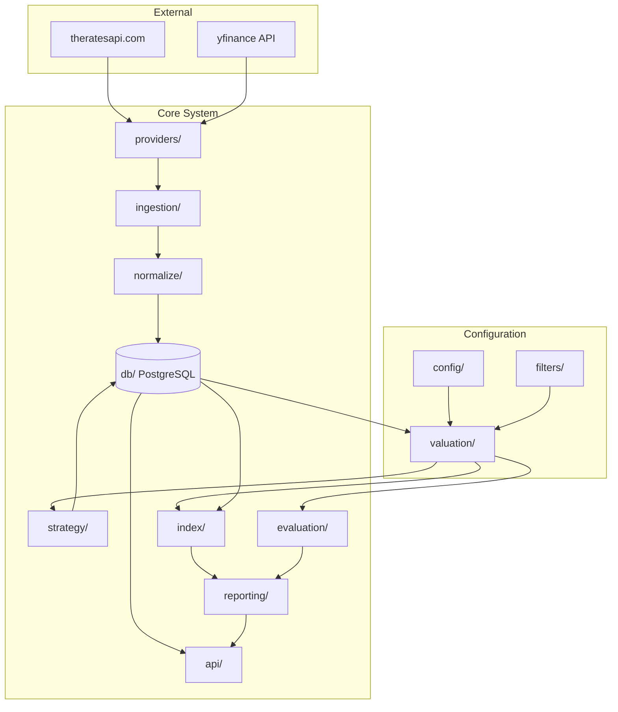

# Financial Statement Evaluator System

> A portfolio analysis tool that **predicts fair market cap from financial statements** and evaluates prediction accuracy over time. NOT a time-series price predictor.

---

## System Overview

This system ingests financial statements and metadata for tickers, uses ML models (XGBoost with bootstrap-crossval) to predict fair market cap, and evaluates prediction accuracy as a financial audit.

### What This System Is

- Ingests **financial statements + metadata** for tickers from yfinance
- Stores **one normalized snapshot row** per ticker per statement timestamp (in USD)
- Predicts **fair market cap** from statements using ML models
- Evaluates **prediction accuracy** via relative error analysis
- Uses **bootstrap-crossval** (repeated nested CV) for confidence intervals

### What This System Is NOT

- ⚡ **NOT** a price time-series modeling system
- ⚡ **NOT** a daily return predictor
- ⚡ **NO** pooled OHLCV tables or daily feature tables

---

## Python Coding Standards

All Python code **MUST** follow these requirements:

- **Type annotations**: All functions must have complete type hints
- **Linting**: Ruff (or flake8 + isort)
- **Formatting**: Black (line length: 88)
- **Type checking**: mypy (strict mode)
- **Docstrings**: Google or NumPy style for all public functions/classes
- **No `# type: ignore`** without explicit justification

---

## Core Approach

Based on `value_analysis.py`:

```python
# Predict market cap from financial features
X = financial_metrics  # revenue, margins, debt, FCF, etc.
y = market_cap

# Nested cross-validation repeated N times
for i in range(100):
    y_pred = cross_val_predict(GridSearchCV(xgb), X, y, cv=outer_cv)
    
# Output: mean ± std per ticker
relative_error = (pred_mean - actual_mcap) / actual_mcap
```

**Evaluation is a financial audit**: compare predicted market cap to actual, track accuracy over time.

---

## Module Architecture



### Module Dependency Order (bottom-up)

| Layer | Modules | Description |
|-------|---------|-------------|
| **Configuration** | `config/`, `filters/` | Python-based model + filter config |
| **Infrastructure** | `db/`, `providers/` | PostgreSQL, yfinance, theratesapi |
| **Data Pipeline** | `ingestion/`, `normalize/` | Fetch + USD conversion |
| **Analysis** | `valuation/` | XGBoost bootstrap-crossval + filtering |
| **Application** | `strategy/`, `evaluation/`, `index/` | Portfolio + accuracy audit + index aggregation |
| **Interface** | `api/`, `reporting/` | REST API + charts |

---

## Configuration Philosophy

**Python-based config with adapters** (not YAML):
- Model parameters, loss functions, features in Python files
- Easy to swap models by changing `ACTIVE_MODEL`
- Dataset filters as composable predicates
- Low abstraction, high flexibility for tinkering

```python
# src/config/models.py
ACTIVE_MODEL = XGBoostAdapter()  # Easy to swap

# src/filters/config.py
ACTIVE_FILTER = (
    DatasetFilter()
    .add(market_cap_min(1e9))
    .add(currency_filter("USD"))
)
```

---

## Data Flow with Filtering

```
┌─────────────┐    ┌───────────────┐    ┌─────────────────┐
│  ingestion  │───▶│   normalize   │───▶│ PostgreSQL (ALL)│
│   (yfinance)│    │  (USD convert)│    │    raw data     │
└─────────────┘    └───────────────┘    └────────┬────────┘
                                                 │
                                                 ▼
                                     ┌───────────────────┐
                                     │  filters (config) │
                                     │  ◦ market_cap_min │
                                     │  ◦ currency       │
                                     │  ◦ quality        │
                                     └─────────┬─────────┘
                                               │
                                               ▼
                                     ┌───────────────────┐
                                     │    valuation      │
                                     │  (XGBoost + CV)   │
                                     └───────────────────┘
```

**Key insight**: Filters are owned by **valuation module**, not ingestion. Raw data is preserved.

---

## Key Design Decisions (All Resolved)

| Decision | Resolution |
|----------|------------|
| **Core approach** | Financial audit: predict mcap, evaluate accuracy |
| **Model** | XGBoost with nested CV, repeated 100x (bootstrap-crossval) |
| **Model config** | Python adapters + JSON serialization for reproducibility |
| **Database** | PostgreSQL |
| **Currency** | Attempt USD conversion; fallback to local currency |
| **Dates** | Store both `filing_date` AND `release_date` |
| **Provider** | yfinance (abstracted for swappability) |
| **FX provider** | theratesapi.com |
| **Filters** | Composable predicates, owned by valuation |
| **Data versioning** | Immutable data versions with SHA256 hash |
| **Model versioning** | JSON-serializable ModelConfig with builder pattern |

---

## Repository Structure

```
app/
  src/
    config/                     # Python-based model/feature config
      models.py                 # Model adapters (XGBoost, RF)
      features.py               # Feature selection config
      loss_functions.py         # Custom loss functions
    
    filters/                    # Dataset filtering (owned by valuation)
      predicates.py             # Filter functions
      composer.py               # Combine filters
      config.py                 # ACTIVE_FILTER
    
    db/                         # PostgreSQL schema and repositories
    providers/                  # yfinance + theratesapi abstraction
    ingestion/                  # Data fetching + index constituents
    normalize/                  # USD conversion + quality
    valuation/                  # Bootstrap-crossval ML
    strategy/                   # Portfolio construction
    evaluation/                 # Prediction accuracy audit
    index/                      # Index aggregation with uncertainty
    reporting/                  # Report generation
    api/                        # REST API endpoints

  scripts/
    run_ingest.py
    run_valuation.py
    run_evaluation.py

  tests/
```

---

## Constraint Checklist

- [x] No pooled OHLCV tables
- [x] All values in **USD** with stored `fx_rate_to_usd`
- [x] Both **filing_date** and **release_date** stored
- [x] Model config in **Python files** (adapters)
- [x] Filters are **composable** and owned by valuation
- [x] Evaluation is **prediction accuracy**, not return-based
- [x] FX rates via **theratesapi.com**

---

## Open Items

| Item | Status | Notes |
|------|--------|-------|
| Loss function selection | 📌 TODO | MSE default, relative MSE available |
| Feature importance analysis | 📌 TODO | Post-training SHAP analysis |
| Missing FX rate fallback | 📌 TODO | Use nearest date or latest rate |
| Earnings calendar integration | 📌 TODO | For accurate release_date |

---

## Module Design Files

| Module | Purpose |
|--------|---------|
| [config/README.md](config/README.md) | Model adapters, features, loss functions |
| [filters/README.md](filters/README.md) | Dataset filtering predicates |
| [ingestion/README.md](ingestion/README.md) | yfinance data fetching |
| [db/README.md](db/README.md) | PostgreSQL schema |
| [normalize/README.md](normalize/README.md) | USD conversion + quality |
| [valuation/README.md](valuation/README.md) | Bootstrap-crossval XGBoost |
| [strategy/README.md](strategy/README.md) | Portfolio construction |
| [evaluation/README.md](evaluation/README.md) | Accuracy audit |
| [index/README.md](index/README.md) | Index aggregation with uncertainty |
| [api/README.md](api/README.md) | REST API |
| [reporting/README.md](reporting/README.md) | Reporting |
| [providers/README.md](providers/README.md) | Provider abstraction |