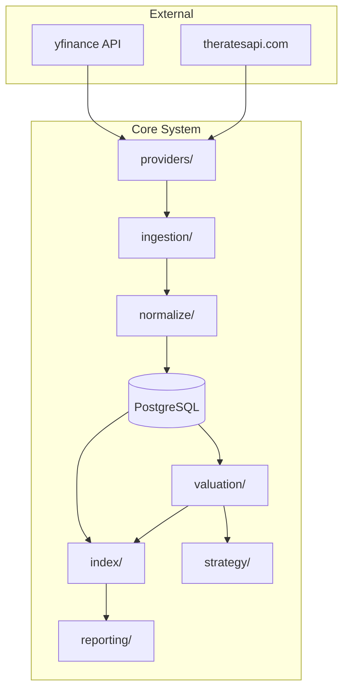

# Misspriced: Financial Statement Valuator

> A portfolio analysis system that predicts fair market capitalization from financial statements and identifies mispriced securities using machine learning.

[](https://www.python.org/downloads/)
[](https://www.postgresql.org/)

---

## Overview

**Misspriced** is a quantitative finance tool that:
- **Predicts fair market capitalization** from financial statements using XGBoost with bootstrap cross-validation
- **Identifies mispriced securities** by comparing predicted vs. actual market caps
- **Aggregates valuations to index level** with uncertainty propagation  
- **Constructs portfolios** based on mispricing magnitude and confidence (in development)

This is **not** a time-series price predictor. Instead, it performs a **financial audit**: "Given these fundamentals, what should this company be worth?"

---

## Quick Start

```bash
# Install dependencies
pip install -r requirements.txt

# Run database migrations
alembic upgrade head

# Ingest financial data
python scripts/populate_snapshots.py

# Run valuation pipeline
python scripts/step3_full_pipeline.py

# Analyze indices
python scripts/run_multi_index.py

# Generate plots
python scripts/plot_indices.py
```

View results in `index_plot.html` and `valuation_plot.html`.

---

## Architecture

### System Flow



### Module Overview

| Module | Purpose |
|--------|---------|
| **providers/** | yfinance + FX rate abstraction |
| **ingestion/** | Fetch financial statements & index constituents |
| **normalize/** | USD conversion + data quality checks |
| **valuation/** | XGBoost market cap prediction with uncertainty |
| **strategy/** | Portfolio construction from mispricing signals |
| **index/** | Index-level aggregation with error propagation |
| **reporting/** | Plot generation and analysis |

---

## Price Prediction Model

### Mathematical Framework

The valuation model predicts market capitalization from financial statement features:

$$
\hat{y}_i = f(X_i; \theta)
$$

Where:
- $\hat{y}_i$ = Predicted market cap for company $i$
- $X_i$ = Feature vector (revenue, EBITDA, debt, ratios, etc.)
- $f$ = XGBoost regression model
- $\theta$ = Hyperparameters (learned via nested cross-validation)

### Bootstrap Cross-Validation

To estimate prediction uncertainty, we use **repeated nested cross-validation**:

```
For n = 1 to N_experiments (N = 100):
    For each outer fold k:
        1. Split data into train/test
        2. Run GridSearchCV on train (inner CV)
        3. Predict on test fold
    
    Store predictions y_pred^(n)

Final estimates:
    μ_i = mean(y_pred_i^(1), ..., y_pred_i^(N))
    σ_i = std(y_pred_i^(1), ..., y_pred_i^(N))
```

This produces a **distribution of predictions** for each ticker, capturing model uncertainty.

### Feature Set

Core features used for prediction:

**Fundamentals**
- Total Revenue
- Gross Profit
- EBITDA
- Total Debt, Total Cash
- Free Cash Flow
- Operating Cash Flow

**Per-Share Metrics**
- Shares Outstanding
- Float Shares
- Book Value

**Financial Ratios**
- Profit Margins
- Debt-to-Equity (log-transformed)
- Return on Assets (ROA)
- Return on Equity (ROE)
- Quick Ratio, Current Ratio

**Risk & Sentiment**
- Audit Risk, Board Risk, Compensation Risk
- Short Interest, Short Ratio
- Insider/Institutional Holdings

### Mispricing Calculation

Relative error measures how much a security is mis valued:

$$
\text{Relative Error}_i = \frac{\hat{\mu}_i - y_i^{\text{actual}}}{y_i^{\text{actual}}}
$$

- **Negative error** → Overpriced (actual > predicted)
- **Positive error** → Underpriced (actual < predicted)

Confidence interval (±2σ):

$$
\text{CI}_i = \left[\hat{\mu}_i - 2\hat{\sigma}_i, \quad \hat{\mu}_i + 2\hat{\sigma}_i\right]
$$

---

## Portfolio Construction Strategy

### Rank-Based Weighting

The portfolio construction strategy selects undervalued securities:

1. **Filter** by minimum confidence score
2. **Rank** by mispricing (most undervalued first)
3. **Select** top N positions
4. **Weight** with position caps

```python
# Rank by mispricing (negative = undervalued)
ranked = sorted(tickers, key=lambda t: relative_error[t])

# Select top N most undervalued
selected = ranked[:max_positions]

# Equal weight with cap
weight_i = min(1/N, max_weight_per_name)
```

### Constraints

- **Max positions**: 30 (default)
- **Max weight per name**: 10%
- **Max sector weight**: 20%
- **Min confidence score**: 0.5
- **Rebalancing**: On new quarterly/annual statements (not daily)

### Long/Short Extension

For long/short portfolios:

$$
w_i = \begin{cases}
+\frac{0.5}{N_{\text{long}}} & \text{if } i \in \text{Top N undervalued} \\\\
-\frac{0.5}{N_{\text{short}}} & \text{if } i \in \text{Top N overvalued} \\\\
0 & \text{otherwise}
\end{cases}
$$

This creates a market-neutral portfolio with net zero exposure.

---

## Index Aggregation

### Index Value Calculation

Given valuations for index constituents, compute the aggregate index value:

**Actual Index Value:**

$$
I^{\text{actual}} = \sum_{i=1}^{N} w_i \cdot y_i^{\text{actual}}
$$

**Estimated Index Value:**

$$
I^{\text{est}} = \sum_{i=1}^{N} w_i \cdot \hat{\mu}_i
$$

Where:
- $w_i$ = Weight of ticker $i$ in index
- $y_i^{\text{actual}}$ = Actual market cap
- $\hat{\mu}_i$ = Predicted market cap (mean)

### Weighting Schemes

| Scheme | Formula | Use Case |
|--------|---------|----------|
| **Equal** | $w_i = \frac{1}{N}$ | Equal influence from all constituents |
| **Market Cap** | $w_i = \frac{y_i^{\text{actual}}}{\sum_j y_j^{\text{actual}}}$ | Track real indices (S&P 500, NASDAQ100) |

### Uncertainty Propagation

Assuming **independent prediction errors** across tickers:

$$
\sigma_I = \sqrt{\sum_{i=1}^{N} w_i^2 \cdot \hat{\sigma}_i^2}
$$

This provides a **lower bound** on index uncertainty (actual correlation would increase it).

### Index Mispricing

Overall index mispricing:

$$
\text{Index Mispricing} = \frac{I^{\text{est}} - I^{\text{actual}}}{I^{\text{actual}}}
$$

---

## Supported Indices

The system tracks 12 global indices:

**United States**
- S&P 500, NASDAQ 100
- S&P 400 (Mid Cap), S&P 600 (Small Cap)  
- Russell 1000

**Europe**
- DAX (Germany), FTSE 100 (UK)
- Euro Stoxx 50, CAC 40 (France), SMI (Switzerland)

**Asia**
- Nifty 50 (India), SSE 50 (China)

All indices are sourced from Wikipedia and mapped to yfinance ticker format.

---

## Configuration

### Model Configuration

Models are configured via Python builder pattern:

```python
from src.valuation.model_builder import ModelBuilder

config = (
    ModelBuilder("xgboost_baseline", "1.0.0")
    .description("XGBoost with core fundamentals")
    .add_core_fundamentals()
    .add_ratio_features()
    .param_grid(
        n_estimators=[100, 300],
        max_depth=[3, 5, 7],
        learning_rate=[0.05, 0.1, 0.2]
    )
    .cv_config(n_experiments=100, outer_splits=4, inner_splits=4)
    .build()
)

# Save for reproducibility
with open("model_config.json", "w") as f:
    f.write(config.to_json())
```

### Dataset Filters

Filters are owned by the valuation module:

```python
from src.filters.composer import DatasetFilter
from src.filters.predicates import market_cap_min, currency_filter

ACTIVE_FILTER = (
    DatasetFilter()
    .add(market_cap_min(1e9))  # $1B minimum
    .add(currency_filter("USD"))
    .add(quality_check())
)
```

---

## Python Coding Standards

All code follows strict typing and linting standards:

- **Type annotations**: All functions with complete type hints
- **Linting**: Ruff (or flake8 + isort)
- **Formatting**: Black (line length: 88)
- **Type checking**: mypy (strict mode)
- **Data models**: Pydantic `BaseModel` (no dataclasses)
- **Docstrings**: Google or NumPy style

---

## Database Schema

### Core Tables

**Tickers**
- `ticker` (PK): Symbol
- `exchange`, `currency`, `sector`, `industry`

**Financial Snapshots**
- `snapshot_id` (PK)
- `ticker`, `snapshot_timestamp`
- Normalized financial metrics (all in USD)
- `fx_rate_to_usd`, `data_quality_score`

**Valuation Results**
- `valuation_id` (PK)
- `ticker`, `snapshot_timestamp`
- `predicted_mcap_mean`, `predicted_mcap_std`
- `actual_mcap`, `relative_error`
- `model_config_hash`, `data_version_id`

**Indices**
- `index_id` (PK): e.g., "SP500"
- `weighting_scheme`, `base_value`

**Index Memberships**
- `index_id`, `ticker`, `as_of_time`
- `source` (e.g., "wikipedia_auto")

---

## Example Output

### Valuation Result

```json
{
  "ticker": "AAPL",
  "predicted_mcap_mean": 2850000000000,
  "predicted_mcap_std": 185000000000,
  "actual_mcap": 2950000000000,
  "relative_error": -0.0339,
  "confidence_interval": [2480000000000, 3220000000000],
  "model_version": "xgboost_baseline_1.0.0"
}
```

**Interpretation**: Apple is **overpriced by 3.4%** relative to predicted fair value.

### Index Analysis

```json
{
  "index_id": "SP500",
  "actual_index": 66787073988608,
  "estimated_index": 63342789948551,
  "estimated_index_std": 1250000000000,
  "index_relative_error": -0.0516,
  "n_tickers": 501,
  "n_tickers_with_valuation": 501
}
```

**Interpretation**: S&P 500 is **overpriced by 5.2%** on aggregate.

---

## Visualization

The system generates interactive Plotly visualizations:

### Index Mispricing Plot


Shows mispricing percentage for all tracked indices with:
- Color coding (red = overpriced, green = underpriced)
- Coverage statistics (tickers with valuations / total constituents)
- Total market caps (actual vs. predicted)

### Valuation Distribution Plot


Shows prediction distribution for individual securities.

---

## Design Philosophy

### What This System Is

- ✅ **Fair value estimator** from financial fundamentals
- ✅ **Mispricing detector** via model predictions
- ✅ **Portfolio constructor** based on value signals
- ✅ **Index analyzer** with uncertainty quantification

### What This System Is NOT

- ❌ **Time-series price predictor** (no OHLCV modeling)
- ❌ **Daily return forecaster** (rebalances quarterly)
- ❌ **Technical analysis tool** (fundamentals only)

### Key Principles

1. **Financial audit mindset**: Predict what companies *should* be worth
2. **Uncertainty quantification**: Every prediction has confidence intervals
3. **Reproducibility**: All model configs serializable to JSON
4. **Data preservation**: Raw data stored, filters applied at analysis time
5. **Currency normalization**: Everything in USD with FX rates stored

---

## Future Enhancements

- [ ] **Alternative models**: Random Forest, LightGBM, neural networks
- [ ] **Custom loss functions**: Relative MSE, quantile regression
- [ ] **Factor models**: Integrate fundamental factors
- [ ] **Transaction costs**: Model slippage and market impact
- [ ] **Sector-neutral portfolios**: Zero net exposure per sector
- [ ] **Real-time updates**: Streaming data integration
- [ ] **API deployment**: REST API for predictions

---

## References

### Data Sources

- **Financial Data**: [yfinance](https://github.com/ranaroussi/yfinance)
- **FX Rates**: [theratesapi.com](https://www.theratesapi.com/)
- **Index Constituents**: Wikipedia (automated scraping)

### Technologies

- **Model**: [XGBoost](https://xgboost.readthedocs.io/)
- **Database**: [PostgreSQL](https://www.postgresql.org/) + [SQLAlchemy](https://www.sqlalchemy.org/)
- **Validation**: [scikit-learn](https://scikit-learn.org/) cross-validation
- **Visualization**: [Plotly](https://plotly.com/python/)

---

## License

This project is for educational and research purposes.

---

## Contact

For questions or contributions, please open an issue on the repository.
